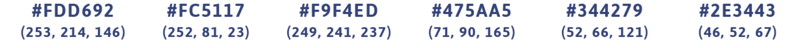

# Building my portfolio to practice bootstrap and git  :nerd_face:

Follow along as I plug away via my [project log](project-log.txt).

Note: This is a new repo integrating Jekyll into my portfolio website. The old repo can be found [here](https://github.com/jgodfreyva/OLD-portfoliosite).

## Colors:
* #FDD692 Peachy
* #FC5117 Bird Orange
* #F9F4ED Egg
* #475AA5 Blue Grandma
* #344279 Denim

