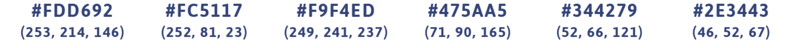

# Building my portfolio to practice bootstrap and git  :nerd_face:

You can read my project log from building the site [here](project-log.txt). 
 
 
 
## Colors:

* #FDD692
* #FC5117
* #F9F4ED
* #475AA5
* #344279
 
 
 

Note: This repo is an iteration of an [earlier repo](https://github.com/jgodfreyva/OLD-portfoliosite). Initialized this one in fall 2019 when integrating Jekyll.

